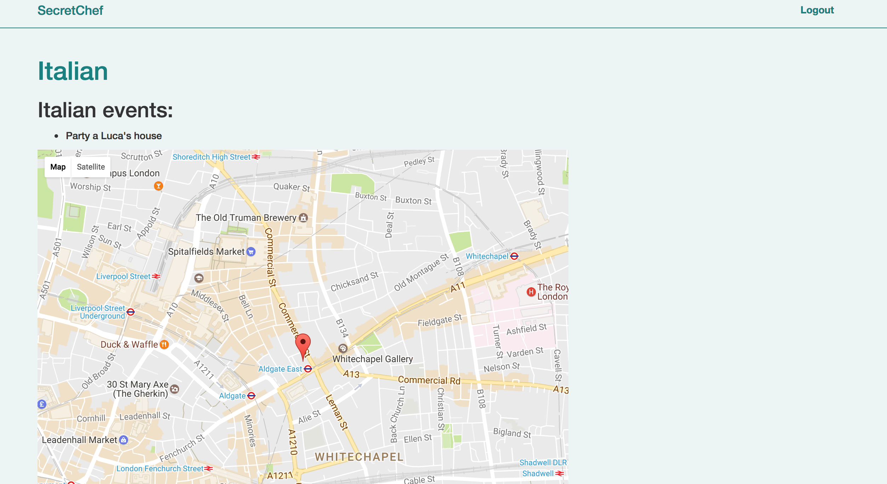

 

___
 

##SecretChef 

###Overview 

My final project is an app that allows budding chefs to organise dinner parties in their own home. I lived in London for the past 18 years and during this time, I have always worked in the hospitality
industry which, amongst other things is a very sociable industry aimed at bringing people together. For my project I wanted to create something that would allow to replicate the social aspect of the hospitality industry in the comfort or one's house.

The registration form allows users to register either as guests or chefs.
As chef users are able to create and edit events which will then be display in a map.

As guests users are able to see the available event and the chef's profile.

###Technologies

- **Ruby on Rails**
- **AngularJS**
- **HTML**
- **SCSS**
- **PostgreSQL**  
- **Bcrypt** and **JWT** for the users authentication
- **NG Maps**
